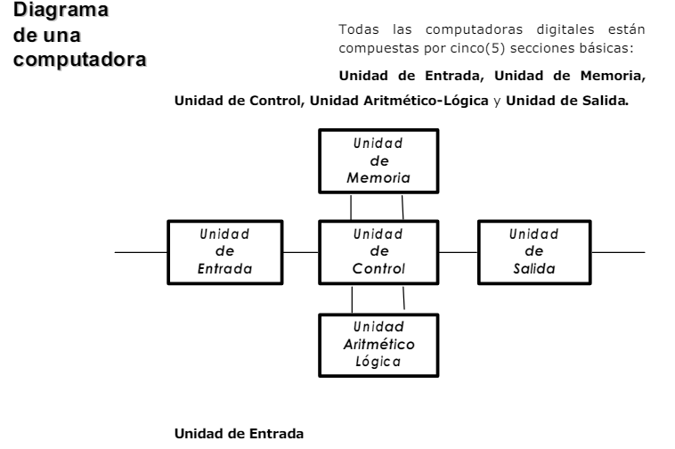

# Informe de Investigación Sobre Arquitectura de Computadoras

Electronica IV - TP - Arquitectura de Computadora

> Barrionuevo, Fátima María

## Introducción

> Fundamentando con citas bibliográficas:
>
> - Define computadora

    Un definición simplificada y general para una computadora puede expresarse como una máquina que es capaz de realizar una secuencia de operaciones mediante un programa,  de tal manera, que procesa un conjunto de datos de entradas y luego se obtienen otro conjunto de datos a su salida.

    Si bien en la actualidad la imagen de computadora esta bastante generalizada a un dispositivo electrónico digital, a lo largo del tiempo esta máquina paso por muchas transformaciones para llegar al dispositvo que conocemos hoy en día.

    A grandes rasgos, según el principio de operación podían dividirse en computadoras analógicas y computadoras digitales.

    Las computadoras analógicas se remotan a las primeras máquinas que facilitaban cálculos y aprovechaban el hecho de que algunos de los fenómenos físicos pueden ser descriptos bajo relaciones matemáticas parecidas, lo que implicaba obtener una solución rápida a la configuración establecida para ese problema. Por otro lado, si el problema que se deseaba resolver respondia a relaciones matemáticas distintas a las establecidas en el dispositivo, para su resolución es necesario reconfigurar todos los circuitos (Hardware).Ejemplos de estas computadoras analógicas son ábaco, máquina de Pascal.

    Las computadoras digitales, por su lado,están basadas en dispositivos biestables (solo tienen dos valores posibles a tomar, '0' ó '1') que poseen la ventaja de poder ejecutar distintos programas para diferentes problemas sin la necesidad de modificar físicamente la máquina.

    

    

> - Define arquitectura de computadoras

    Se trata de un conjunto de reglas, principios y estándares que definen la estructura y el diseño de los componentes de hardware y software que conforman un sistema informático. Esta abarca desde el nivel más bajo (como los circuitos electrónicos y la lógica digita) hasta el nivel más alto (como lo son los sistemas operativos y las aplicaciones).

    La arquitectura de computadoras constituye la base conceptual y técnica que admite la creación de ordenadores y sistemas informáticos funcionales. Incluye la forma en que los componentes se comunican entre sí, la manera en que se gestionan los recursos, cómo se ejecutan las instrucciones, así como el procedimiento de almacenar y acceder a los datos.

> - Distingue entre microarquitectura, arquitectura y software.

    MICROARQUITECTURA: Es la implementacion en el silicio de la arquitectura. Lo que está detrás del set de registros y del modelo de programación. Puede ser muy simple o sumamente robusta y poderosa. Cambia de un modelo a otro dentro de una misma familia.

    ARQUITECTURA: Es el conjunto de recursos accesibles para el programador, que por lo general se mantienen a lo largo de los diferentes modelos de procesadores de esa arquitectura

    SOFTWARE: soporte lógico de un sistema informático, es decir, es la parte no física que hace referencia a un programa o conjunto de programas de cómputo que incluye datos, reglas e instrucciones para poder comunicarse con el hardware y que hacen posible su funcionamiento.

## Clases de arquitectura de computadora

> Fundamentando con citas bibliográficas:
>
> - Explica brevemente los tipos de arquitectura de computadora que hayas encontrado en la bibliografía.

    Entre los modelos de arquitectura de computadoras actuales, los más populares que se encuentran son:

    ARQUITECTURA DE VON NEUMANN : Se basa en la idea de tener una unidad central de procesamiento (CPU) que accede a una memoria compartida para almacenar tanto datos como programas. Las instrucciones y datos se guardan en la misma memoria y se recuperan a través de un bus (o canal) común.

    ARQUITECTURA HARVARD: Es un modelo similar a la arquitectura de Von Neumann, pero este se caracteriza por utilizar memorias físicamente separadas para almacenar las instrucciones del programa y los datos de manera independiente. Esto permite que la CPU acceda simultáneamente a ambos, mejorando el rendimiento en ciertas aplicaciones específicas. Se ha usado principalmente en aplicaciones donde se requiere un alto rendimiento en el procesamiento de señales o en tareas específicas donde el acceso simultáneo a instrucciones y datos es ventajoso.

    ARQUITECTURA RISC (Reduced Instruction Set Computer): Es un enfoque de diseño de procesadores y computadoras que se caracteriza por utilizar un conjunto de instrucciones reducido y altamente optimizado. Los procesadores RISC ejecutan instrucciones en un solo ciclo de reloj, lo que los hace más eficientes en operaciones simples y repetitivas. Además, pueden alcanzar altos niveles de rendimiento, siendo particularmente útiles en aplicaciones que requieren un procesamiento intensivo, como servidores y supercomputadoras. Su efectividad la ha convertido en la base para muchos procesadores modernos.

    ARQUITECTURA CISC (Complex Instruction Set Computer): A diferencia de RISC, los procesadores CISC utilizan un conjunto de instrucciones más amplio y diverso. Estas instrucciones pueden realizar tareas más complejas en un solo ciclo de reloj, lo que facilita la programación, pero puede afectar el rendimiento en ciertos escenarios. Por esta razón, a lo largo del tiempo, se han desarrollado técnicas para mejorar la ejecución de instrucciones CISC, como la segmentación (pipeline) y la ejecución fuera de orden (out-of-order execution).
    

    ARQUITECTURA PARALELA: Es un enfoque de diseño de computadoras que se basa en la utilización de múltiples unidades de procesamiento trabajando en paralelo para realizar tareas y operaciones de manera simultánea. Esto puede lograrse mediante el uso de procesadores multinúcleo o la creación de sistemas con varios procesadores trabajando juntos. Su principal objetivo es mejorar el rendimiento y la eficiencia del sistema informático al dividir las tareas en partes más pequeñas y asignarlas a diferentes procesadores para que trabajen en conjunto.

    ARQUITECTURA DE LA COMPUTACIÓN EN LA NUBE: También conocida como arquitectura de nube. Consiste en una estructura tecnológica que permite el acceso a recursos informáticos a través de internet, como almacenamiento, potencia de procesamiento y aplicaciones, sin que los usuarios tengan que poseer o administrar físicamente los equipos y servidores que los proveen. Esta arquitectura es esencial para la provisión de servicios bajo demanda y la escalabilidad de aplicaciones.

> - Discute para cada tipo sus características distintivas, ventajas y desventajas

> - Considera *al menos* lo siguiente: máquina de pila, máquina de registros y máquina de acumulador; RISC y CISC; Von Newmann y Harvard

> - Sitúa en este contexto la arquitectura ARMv7M

## Partes de una arquitectura de computadora

> Fundamentando con citas bibliográficas:
>
> - Explica las distintas partes de una arquitectura de computadora
> - Analiza a la luz de lo desarrollado la arquitectura ARMv7M

## Conclusiones

> En este capítulo debes exponer con tus palabras lo siguiente
>
> - ¿Qué es, para tí, una arquitectura de computadoras?
> - Si descomponemos un sistema de cómputo en capas ¿Qué posición ocupa la arquitectura?
> - ¿Cuál es la función que cumple una arquitectura de computadora?
> - ¿Qué considerarías a la hora de elegir una arquitectura de computadora?
>
> *Nota:* El contenido de este capítulo expone lo que aprendiste durante la investigación para desarrollar este práctico. Es un espacio para tu propia reflexión. Intenta exponer tus propias ideas, tal vez sea bueno hacerlo luego de apartarte unas horas del material de referencia para evitar seguir demasiado de cerca una fuente particular.

## Bibliografía

> Aquí listarás todas las fuentes bibliográficas citadas. Sigue para tus citas y referencias las [normas de la APA](https://normas-apa.org/citas/), usando *citas parrafraseadas* en el texto.
